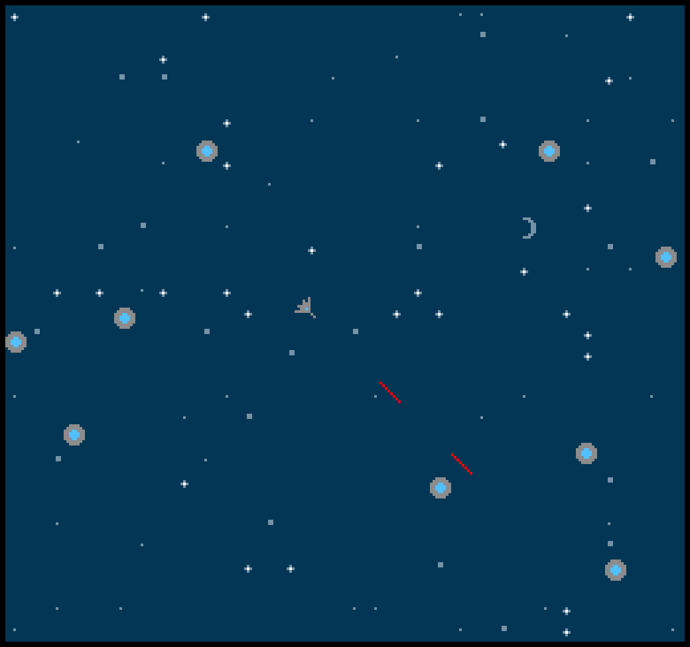

# Space Battle

Author: Nolan Mass

Design: Control a small starship and try to shoot the evil flying saucers with your laser before they shoot you.

Screen Shot:

How Your Asset Pipeline Works:
I read in some PNG files in the dist folder and convert them into tiles. I created a function that takes in the tile index and pallette index to load the PNG into. The background tiles are placed randomly (except for the moon) to form a pattern of stars.

How To Play:
Use arrow keys to move around and press space to shoot. The goal is to shoot all of the flying saucers without getting hit. 

Sources:
This game was built with [NEST](NEST.md).

